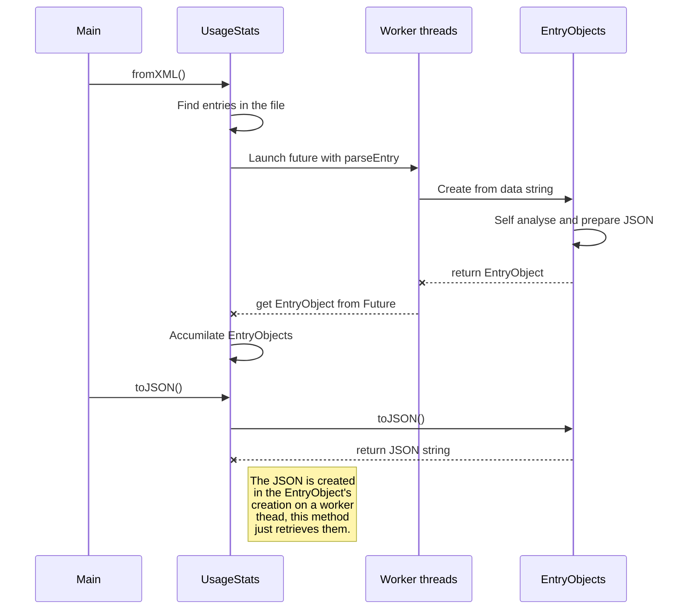
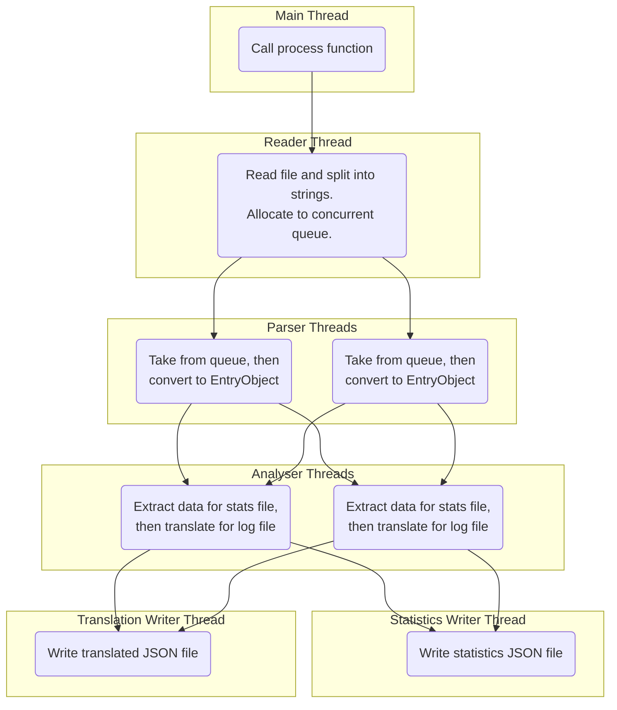

# Pathfinding to the right decision - Ashley Smith
## Overview

This project aims to investigate further uses for established pathfinding algorithms. Traditionally, algorithms such as A* are about getting from $A$ to $B$ when given some data like a roadmap of a city or a grid of tiles or points for a video game. When implemented, these algorithms will be given this data as a graph of nodes where the edges represent things like distance, maximum speed or the traversal time, all of which are based on moving from one node to the next. In this project, I want to attempt to substitute these types for *any* type in a similar way to how we use algebra to factor out variables. In functional programming, functions themselves can be treated as variables, and so by adopting similar methods we ignore the details about *how* and *why* we are pathfinding and *what with*.

## Uses

In video games, pathfinding takes a backseat when it comes to decision making. In games like worms, an enemy might decide that attacking the player is a reasonable thing to do, but then proceeds to path awkwardly into an open area, thus exposing themselves for attack. In the Sims, characters sometimes make silly judgements such as going next door to eat food because there's none on the fridge. Asking questions such as 'how far away am I from $x$' requires explicit consideration by game programmers. Taking things further, the idea of specifically catering to these use cases becomes a rigid process without complicating the engine's infrastructure could make programming things like agent personalities significantly difficult. If the distance to a point of interest was valued in a similar way to how the interest itself is valued, agents will respond more and more naturally to distance as values are tweaked.

I can't be certain as to what other types of games this algorithm would be suited towards. You *could* apply it to games such as Tic-Tac-Toe, but it is important to remember that only one decision can be made per turn in these types of games, and so the generated path isn't much of a path but more of a single decision consisting of 'which edge leads to the best node'. While the algorithm has done it's job, it hasn't been used to it's fullest and so a different algorithm would be better suited. Games where the AI needs to make multiple decisions would be far better suited, as the decision to take an action would be it's own edge leading to a node, which could then be traversed normally by an algorithm like A*.

## Re-implementation
### Summary

```cpp
// Evaluates options and returns a stack of actions to take
// Templates: thought STATE, ACTION, decision COST
template <class S, class A, class C>
std::pair<bool, std::stack<A>> decide(
    const S& startingState,
    const C& minimumCost,
    const C& maximumCost,
    std::function<std::vector<A>(const S&)> getPossibleActions,
    std::function<bool(const S&, const S&)> isStateEndpoint,
    std::function<C(const S&)> heuristic,
    std::function<C(const S&, const S&, const A&)> weighAction,
    std::function<std::pair<bool, const S>(const S&, const A&)> takeAction,
    std::function<bool(const C&, const C&)> compareCost) {
```

When changing A* into a decision making algorithm instead of a pathfinding one, it's arguments should become generic in order to accommodate the possible options and allow for easier reusing of code. WRITE MORE HERE

### Step 1: Separating edges from nodes
A* takes a graph of nodes, starting and destination nodes $A$ and $B$, and a heuristic function $h$ for calculating the remaining distance or travel time. This must be amended if A* is going to make decisions. To make this easier, I'm going to write as if we're keeping the theme of a video game's AI agent getting from $A$ to $B$ but changing the concept of *generating the path* to *deciding which path to take*. 

Normally in these situations the nodes contain coordinates to the locations they represent in the game (that's if the node itself isn't a coordinate). This makes it trivial to find the distance between connected nodes $X$ and $Y$, as you can simply calculate displacement $d=Y - X$. However, going back to our amended version, we want to separate the *action* from the *result of taking it* - in this case, the `Action` of moving with displacement $d$ and our new `State` with our location at $Y$. It is very easy to combine these two types when they're both in vector form, so its important to declare up front that it is **not required** for an `Action` to be of the same type as a `State`.

`State`s can be anything, from raw location data to complex concepts like the playfield of a game or even the `State` of thought of an AI containing it's perceptions, it's knowledge, it's health status or personal objectives. `Action`s are acts that impact the `State` in some way, such as navigating, healing, expending ammunition to fire at enemies or possibly waiting for time to pass.

Now we have to amend the algorithm with `Action` and `State` taken into consideration. The nodes of the graph to traverse are `State`s and the edges between them are `Action`s. This gives us some possible interactions such as many `Action`s leading us to the same `State`, although in the current example it'd be impossible to move in a different direction and end up in the same place as if the agent had decided to move differently.

### Step 2: Revisiting the graph
The next thing that needs attention is the graph itself. Rather than passing in the graph of nodes, it'd make things a lot more flexible if the programmer could decide how this graph is found. One of the main reasons I think this is a good move is that we know longer know what a `State` or `Action` really is, and so the algorithm no longer has a say as to what `Action`s are available to take. In terms of the standard implementation, the `Action` that can be taken from any given `State` would simply be derived from the neighbours of the current node. However, what if some `Action`s are one way? What if you can only take an `Action` from a specific state, or after taking a chain of `Action`s previously?

```cpp
std::function<std::vector<A>(const S&)> getPossibleActions
```

All of these would normally require special consideration, so instead of providing any kind of graph, we will allow the programmer to inject their graph through a function. In the test harness, this function is called `getPossibleActions`. This function will return a list of actions for any given state. It is then up to the programmer to pack enough information into the state such that they can derive what the agent could do at this point in time. For a traditional graph, this would just be a traditional look up function in an `std::map` of connections. However, this also allows for more abstract concepts - in Tic-Tac-Toe, there is no navigation. Instead, the possible `Action`s returned by this function are actually coordinates representing the different moves the AI could take. 

### Step 3: Removing the notion of a destination
```cpp
std::function<bool(const S&, const S&)> isStateEndpoint
```
It would be very difficult to provide a single `State` as a destination for a problem like this. Again, I factored out the process of comparing a given `State` to a destination into the function `isStateEndpoint`, as in, 'should the decision making process be terminated once this `State` has been reached?'

For our example, this function would return `true` when the coordinates contained in the given `State` match those desired. Again though, you can take this further as multiple `State`s can be endpoints - in the Tic-Tac-Toe scene, every action leads to an endpoint as only one move can be made at a time. The condition that makes this function return `true` is simply that the turn tracker has been incremented.

### Step 4: Abstracting weight of an edge
With abstract `State`s and `Action`s in play, a problem arises from trying to choose what to do. The next amendment is this idea of `Cost`. Again, we don't care what a `State` or an `Action` consists or, nor do we care about the `Cost` of taking a given action. It is important to note that doing the same `Action` from a different `State` may result in a different `Cost` - an obvious example being the throwing of a grenade in the agent's own base versus the opponent's. On it's own, the `Cost` class doesn't do much, but it is important to multiple functions in this implementation.

```cpp
std::function<bool(const C&, const C&)> compareCost
```

It isn't obvious what low or high `Cost` instances are, so the programmer should also provide the equivalent to $0$ and $\infty$ if the `Cost` type was an `integer` in the variables `minimumCost` and `maximumCost` . A* works by ignoring routes that have a calculated `Cost` higher than the others, always working with the lowest `Cost` route. The programmer will also need to provide the function `compareCost` to tell A* which `Cost` instance is the better one.

### Step 5: Understanding the heuristic function
```cpp
std::function<C(const S&)> heuristic
```
The programmer will need to provide the function `heuristic`. This will estimate the `Cost` of finishing the decision making process after pathing through the given node. This is used by A* to optimise the order of which routes are evaluated. Nothing has changed from the traditional A* implementation, but it's important to note that this function evaluates a `State` and so more thought may be needed. The Tic-Tac-Toe scene does not need a heuristic

### Step 6: Evaluating an action
```cpp
std::function<C(const S&, const S&, const A&)> weighAction
```
The function `weighAction` takes two `State`s and an `Action`. The first `State` is the current one, whereas the second is the resulting `State` after the given `Action` has been taken. This function is critical as it is what separates the good decisions from the bad. For navigation, this is trivial as you can simply use distance, travel time or something similar. 

In the Tic-Tac-Toe example, the `Cost` class uses the idea of `logicPenalties` that penalise the agent for making bad decisions. While it is down to the programmer to create this function, these checks are all encapsulated in this one function, allowing the programmer to have different evaluation functions used in multiple agents. The penalties are completely arbitrary and tweaking the values can completely change what the agent values. Randomness could also be implemented at this stage by increasing the cost by a random amount to slightly influence decisions between `Action`s with similar `Cost`s.

### Step 7: Generating actions from states
```cpp
std::function<std::pair<bool, const S>(const S&, const A&)> takeAction
```
Finally, the programmer will provide the `takeAction` function. When given a `State` and an `Action` to take, this function will return an `std::pair` containing a `bool` acting as a flag for if the operation was successful and the resulting `State`. If the `bool` is `true`, then the `State` is valid and can be further evaluated. In navigation, this function would simply combine the current location with the displacement to get the next location. In Tic-Tac-Toe, this function would place a mark on the requested tile if it is unoccupied, alternate the current player and increment the turn counter. 

This function is used to generate the possible future `State`s for every `Action` provided by `getPossibleActions`. After checking that these `Action`s do indeed lead to a valid `State`, the `Action`s are then weighed with `weighAction` and their `Cost`s are compared with `compareCost`. Everything else works like normal A*, managing `std::map`s of `State`s to `Cost`s etc.

# Delete
You can render LaTeX mathematical expressions using [KaTeX](https://khan.github.io/KaTeX/):

The *Gamma function* satisfying $\Gamma(n) = (n-1)!\quad\forall n\in\mathbb N$ is via the Euler integral

$$
\Gamma(z) = \int_0^\infty t^{z-1}e^{-t}dt\,.
$$

> You can find more information about **LaTeX** mathematical expressions [here](http://meta.math.stackexchange.com/questions/5020/mathjax-basic-tutorial-and-quick-reference).


### Old method

Initially, I used multiple threads to parse entry strings into `EntryObject`s. However, making my class flexible made it susceptible to crashes as the demand for stored data increased.

### New method

In my current implementation, I went for a pipeline approach. While only one thread can read and one read can write per file, my program does work with multiple threads in the parsing and analysing stages. I chose not to do this in my final version though, as I actually clocked mine to go faster without the extra threads, most likely due to threads fighting over jobs and more time spent on yielding. The tasks at hand appear computationally balanced and I don't think there's a need to process the data any faster when the bottleneck is the IO from the reader thread anyway.## Techniques used  
  

### Threads and concurrent containers  

While I did use `std::future` at one point, I ended up just using `std::thread`s which continuously take from `concurrency::concurrent_queue`s and processes them before passing them down the pipeline. I create these threads at the start of the process and close them at the end.  
  

```cpp  
// Read an XML file and provide data  
std::thread reader(&UsageStats::fromXML, this, xml);  
  
// Parse entry data into an EntryObject for analysis  
std::thread parser(&UsageStats::parseEntries, this);  
  
// Take elements from an EntryObject for analysis and writing  
std::thread analyser(&UsageStats::extractData, this);  
  
// Translate EntryObjects into JSON file  
std::thread translationWriter(&UsageStats::toJSON, this, json);  
  
// Write analysis into JSON file  
std::thread statisticsWriter(&UsageStats::writeStatistics, this, stats);  
  
// Wait for all other threads to finish  
reader.join();  
parser.join();  
analyser.join();  
translationWriter.join();  
statisticsWriter.join();  
```  
  

### Limiting write calls  

I noticed that a large slowdown was due to the amount of write calls. I actually log the amount of write calls I do in my code so I could compare it between implementations. Instead of writing data to the disk when I have it available, instead I accumilate it into an `std::string` and write the entire batch every now and then. I didn't know how many iterations would be safe to batch, so I tested on machines at university and on my less powerful laptop to find a comfortable value.  

```cpp  
// Append the data to write to string  
outString += "{\"sessionID\":\"" +  
  time.first + "\",\"duration\":" +  
  std::to_string(time.second) + "}";  
  
// Keep count of iterations  
++sessionsProcessed;  
  
// Write into the stats JSON file if  
// we have a lot of data to write  
if (sessionsProcessed % 100000 == 0) {  
  of << outString;  
  outString.clear();  
  ++fileWrites;  
}  
```  
  

### Output to terminal  

To speed the program up further, I needed to limit my prints to the console. I believe it is unethical to provide no kind of feedback to the user, so if the XML file is large enough there will be occasional `printf` calls to maintain confidence in the program. I tried both `std::cout` and `printf`, and I found that `printf` was the faster choice which aligned with my findings from a previous assignment. This is probably due to the fact that `printf` is a C function rather than a C++ function.## Techniques used  
  

### Threads and concurrent containers  

While I did use `std::future` at one point, I ended up just using `std::thread`s which continuously take from `concurrency::concurrent_queue`s and processes them before passing them down the pipeline. I create these threads at the start of the process and close them at the end.  
  

```cpp  
// Read an XML file and provide data  
std::thread reader(&UsageStats::fromXML, this, xml);  
  
// Parse entry data into an EntryObject for analysis  
std::thread parser(&UsageStats::parseEntries, this);  
  
// Take elements from an EntryObject for analysis and writing  
std::thread analyser(&UsageStats::extractData, this);  
  
// Translate EntryObjects into JSON file  
std::thread translationWriter(&UsageStats::toJSON, this, json);  
  
// Write analysis into JSON file  
std::thread statisticsWriter(&UsageStats::writeStatistics, this, stats);  
  
// Wait for all other threads to finish  
reader.join();  
parser.join();  
analyser.join();  
translationWriter.join();  
statisticsWriter.join();  
```  
  

### Limiting write calls  

I noticed that a large slowdown was due to the amount of write calls. I actually log the amount of write calls I do in my code so I could compare it between implementations. Instead of writing data to the disk when I have it available, instead I accumilate it into an `std::string` and write the entire batch every now and then. I didn't know how many iterations would be safe to batch, so I tested on machines at university and on my less powerful laptop to find a comfortable value.  

```cpp  
// Append the data to write to string  
outString += "{\"sessionID\":\"" +  
  time.first + "\",\"duration\":" +  
  std::to_string(time.second) + "}";  
  
// Keep count of iterations  
++sessionsProcessed;  
  
// Write into the stats JSON file if  
// we have a lot of data to write  
if (sessionsProcessed % 100000 == 0) {  
  of << outString;  
  outString.clear();  
  ++fileWrites;  
}  
```  
  

### Output to terminal  

To speed the program up further, I needed to limit my prints to the console. I believe it is unethical to provide no kind of feedback to the user, so if the XML file is large enough there will be occasional `printf` calls to maintain confidence in the program. I tried both `std::cout` and `printf`, and I found that `printf` was the faster choice which aligned with my findings from a previous assignment. This is probably due to the fact that `printf` is a C function rather than a C++ function.## Techniques used  
  

### Threads and concurrent containers  

While I did use `std::future` at one point, I ended up just using `std::thread`s which continuously take from `concurrency::concurrent_queue`s and processes them before passing them down the pipeline. I create these threads at the start of the process and close them at the end.  
  

```cpp  
// Read an XML file and provide data  
std::thread reader(&UsageStats::fromXML, this, xml);  
  
// Parse entry data into an EntryObject for analysis  
std::thread parser(&UsageStats::parseEntries, this);  
  
// Take elements from an EntryObject for analysis and writing  
std::thread analyser(&UsageStats::extractData, this);  
  
// Translate EntryObjects into JSON file  
std::thread translationWriter(&UsageStats::toJSON, this, json);  
  
// Write analysis into JSON file  
std::thread statisticsWriter(&UsageStats::writeStatistics, this, stats);  
  
// Wait for all other threads to finish  
reader.join();  
parser.join();  
analyser.join();  
translationWriter.join();  
statisticsWriter.join();  
```  
  

### Limiting write calls  

I noticed that a large slowdown was due to the amount of write calls. I actually log the amount of write calls I do in my code so I could compare it between implementations. Instead of writing data to the disk when I have it available, instead I accumilate it into an `std::string` and write the entire batch every now and then. I didn't know how many iterations would be safe to batch, so I tested on machines at university and on my less powerful laptop to find a comfortable value.  

```cpp  
// Append the data to write to string  
outString += "{\"sessionID\":\"" +  
  time.first + "\",\"duration\":" +  
  std::to_string(time.second) + "}";  
  
// Keep count of iterations  
++sessionsProcessed;  
  
// Write into the stats JSON file if  
// we have a lot of data to write  
if (sessionsProcessed % 100000 == 0) {  
  of << outString;  
  outString.clear();  
  ++fileWrites;  
}  
```  
  

### Output to terminal  

To speed the program up further, I needed to limit my prints to the console. I believe it is unethical to provide no kind of feedback to the user, so if the XML file is large enough there will be occasional `printf` calls to maintain confidence in the program. I tried both `std::cout` and `printf`, and I found that `printf` was the faster choice which aligned with my findings from a previous assignment. This is probably due to the fact that `printf` is a C function rather than a C++ function.## Techniques used  
  

### Threads and concurrent containers  

While I did use `std::future` at one point, I ended up just using `std::thread`s which continuously take from `concurrency::concurrent_queue`s and processes them before passing them down the pipeline. I create these threads at the start of the process and close them at the end.  
  

```cpp  
// Read an XML file and provide data  
std::thread reader(&UsageStats::fromXML, this, xml);  
  
// Parse entry data into an EntryObject for analysis  
std::thread parser(&UsageStats::parseEntries, this);  
  
// Take elements from an EntryObject for analysis and writing  
std::thread analyser(&UsageStats::extractData, this);  
  
// Translate EntryObjects into JSON file  
std::thread translationWriter(&UsageStats::toJSON, this, json);  
  
// Write analysis into JSON file  
std::thread statisticsWriter(&UsageStats::writeStatistics, this, stats);  
  
// Wait for all other threads to finish  
reader.join();  
parser.join();  
analyser.join();  
translationWriter.join();  
statisticsWriter.join();  
```  
  

### Limiting write calls  

I noticed that a large slowdown was due to the amount of write calls. I actually log the amount of write calls I do in my code so I could compare it between implementations. Instead of writing data to the disk when I have it available, instead I accumilate it into an `std::string` and write the entire batch every now and then. I didn't know how many iterations would be safe to batch, so I tested on machines at university and on my less powerful laptop to find a comfortable value.  

```cpp  
// Append the data to write to string  
outString += "{\"sessionID\":\"" +  
  time.first + "\",\"duration\":" +  
  std::to_string(time.second) + "}";  
  
// Keep count of iterations  
++sessionsProcessed;  
  
// Write into the stats JSON file if  
// we have a lot of data to write  
if (sessionsProcessed % 100000 == 0) {  
  of << outString;  
  outString.clear();  
  ++fileWrites;  
}  
```  
  

### Output to terminal  

To speed the program up further, I needed to limit my prints to the console. I believe it is unethical to provide no kind of feedback to the user, so if the XML file is large enough there will be occasional `printf` calls to maintain confidence in the program. I tried both `std::cout` and `printf`, and I found that `printf` was the faster choice which aligned with my findings from a previous assignment. This is probably due to the fact that `printf` is a C function rather than a C++ function.## Techniques used  
  

### Threads and concurrent containers  

While I did use `std::future` at one point, I ended up just using `std::thread`s which continuously take from `concurrency::concurrent_queue`s and processes them before passing them down the pipeline. I create these threads at the start of the process and close them at the end.  
  

```cpp  
// Read an XML file and provide data  
std::thread reader(&UsageStats::fromXML, this, xml);  
  
// Parse entry data into an EntryObject for analysis  
std::thread parser(&UsageStats::parseEntries, this);  
  
// Take elements from an EntryObject for analysis and writing  
std::thread analyser(&UsageStats::extractData, this);  
  
// Translate EntryObjects into JSON file  
std::thread translationWriter(&UsageStats::toJSON, this, json);  
  
// Write analysis into JSON file  
std::thread statisticsWriter(&UsageStats::writeStatistics, this, stats);  
  
// Wait for all other threads to finish  
reader.join();  
parser.join();  
analyser.join();  
translationWriter.join();  
statisticsWriter.join();  
```  
  

### Limiting write calls  

I noticed that a large slowdown was due to the amount of write calls. I actually log the amount of write calls I do in my code so I could compare it between implementations. Instead of writing data to the disk when I have it available, instead I accumilate it into an `std::string` and write the entire batch every now and then. I didn't know how many iterations would be safe to batch, so I tested on machines at university and on my less powerful laptop to find a comfortable value.  

```cpp  
// Append the data to write to string  
outString += "{\"sessionID\":\"" +  
  time.first + "\",\"duration\":" +  
  std::to_string(time.second) + "}";  
  
// Keep count of iterations  
++sessionsProcessed;  
  
// Write into the stats JSON file if  
// we have a lot of data to write  
if (sessionsProcessed % 100000 == 0) {  
  of << outString;  
  outString.clear();  
  ++fileWrites;  
}  
```  
  

### Output to terminal  

To speed the program up further, I needed to limit my prints to the console. I believe it is unethical to provide no kind of feedback to the user, so if the XML file is large enough there will be occasional `printf` calls to maintain confidence in the program. I tried both `std::cout` and `printf`, and I found that `printf` was the faster choice which aligned with my findings from a previous assignment. This is probably due to the fact that `printf` is a C function rather than a C++ function.## Techniques used  
  

### Threads and concurrent containers  

While I did use `std::future` at one point, I ended up just using `std::thread`s which continuously take from `concurrency::concurrent_queue`s and processes them before passing them down the pipeline. I create these threads at the start of the process and close them at the end.  
  

```cpp  
// Read an XML file and provide data  
std::thread reader(&UsageStats::fromXML, this, xml);  
  
// Parse entry data into an EntryObject for analysis  
std::thread parser(&UsageStats::parseEntries, this);  
  
// Take elements from an EntryObject for analysis and writing  
std::thread analyser(&UsageStats::extractData, this);  
  
// Translate EntryObjects into JSON file  
std::thread translationWriter(&UsageStats::toJSON, this, json);  
  
// Write analysis into JSON file  
std::thread statisticsWriter(&UsageStats::writeStatistics, this, stats);  
  
// Wait for all other threads to finish  
reader.join();  
parser.join();  
analyser.join();  
translationWriter.join();  
statisticsWriter.join();  
```  
  

### Limiting write calls  

I noticed that a large slowdown was due to the amount of write calls. I actually log the amount of write calls I do in my code so I could compare it between implementations. Instead of writing data to the disk when I have it available, instead I accumilate it into an `std::string` and write the entire batch every now and then. I didn't know how many iterations would be safe to batch, so I tested on machines at university and on my less powerful laptop to find a comfortable value.  

```cpp  
// Append the data to write to string  
outString += "{\"sessionID\":\"" +  
  time.first + "\",\"duration\":" +  
  std::to_string(time.second) + "}";  
  
// Keep count of iterations  
++sessionsProcessed;  
  
// Write into the stats JSON file if  
// we have a lot of data to write  
if (sessionsProcessed % 100000 == 0) {  
  of << outString;  
  outString.clear();  
  ++fileWrites;  
}  
```  
  

### Output to terminal  

To speed the program up further, I needed to limit my prints to the console. I believe it is unethical to provide no kind of feedback to the user, so if the XML file is large enough there will be occasional `printf` calls to maintain confidence in the program. I tried both `std::cout` and `printf`, and I found that `printf` was the faster choice which aligned with my findings from a previous assignment. This is probably due to the fact that `printf` is a C function rather than a C++ function.## Techniques used  
  

### Threads and concurrent containers  

While I did use `std::future` at one point, I ended up just using `std::thread`s which continuously take from `concurrency::concurrent_queue`s and processes them before passing them down the pipeline. I create these threads at the start of the process and close them at the end.  
  

```cpp  
// Read an XML file and provide data  
std::thread reader(&UsageStats::fromXML, this, xml);  
  
// Parse entry data into an EntryObject for analysis  
std::thread parser(&UsageStats::parseEntries, this);  
  
// Take elements from an EntryObject for analysis and writing  
std::thread analyser(&UsageStats::extractData, this);  
  
// Translate EntryObjects into JSON file  
std::thread translationWriter(&UsageStats::toJSON, this, json);  
  
// Write analysis into JSON file  
std::thread statisticsWriter(&UsageStats::writeStatistics, this, stats);  
  
// Wait for all other threads to finish  
reader.join();  
parser.join();  
analyser.join();  
translationWriter.join();  
statisticsWriter.join();  
```  
  

### Limiting write calls  

I noticed that a large slowdown was due to the amount of write calls. I actually log the amount of write calls I do in my code so I could compare it between implementations. Instead of writing data to the disk when I have it available, instead I accumilate it into an `std::string` and write the entire batch every now and then. I didn't know how many iterations would be safe to batch, so I tested on machines at university and on my less powerful laptop to find a comfortable value.  

```cpp  
// Append the data to write to string  
outString += "{\"sessionID\":\"" +  
  time.first + "\",\"duration\":" +  
  std::to_string(time.second) + "}";  
  
// Keep count of iterations  
++sessionsProcessed;  
  
// Write into the stats JSON file if  
// we have a lot of data to write  
if (sessionsProcessed % 100000 == 0) {  
  of << outString;  
  outString.clear();  
  ++fileWrites;  
}  
```  
  

### Output to terminal  

To speed the program up further, I needed to limit my prints to the console. I believe it is unethical to provide no kind of feedback to the user, so if the XML file is large enough there will be occasional `printf` calls to maintain confidence in the program. I tried both `std::cout` and `printf`, and I found that `printf` was the faster choice which aligned with my findings from a previous assignment. This is probably due to the fact that `printf` is a C function rather than a C++ function.

